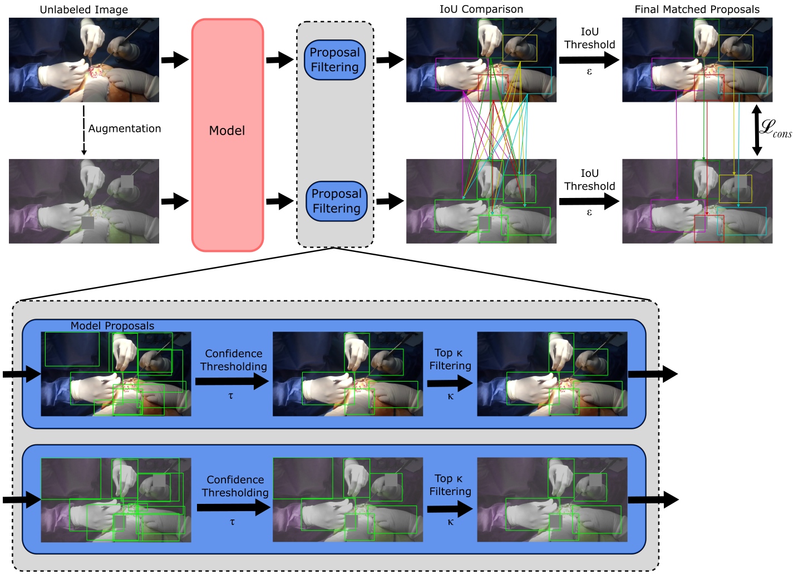

<p align="center">

  <h1 align="center">Robust Semi-supervised Detection of Hands in Diverse Open Surgery Environments
  </h1>
  <h3 align="center">
    <strong>Pranav Vaid</strong>
    ,
    <strong>Serena Yeung</strong>
    ,
    <strong>Anita Rau</strong>
  <h3 align="center">In Machine Learning for Healthcare (MLHC) 2023</h3>
  <div align="center">
  </div>
</p>

<div>
  
</div>

## Setup

To install necessary dependencies, run the following commands from the repository root. Note that we implement the consistency loss in a custom version of Detectron2, which is provided with this repository.

```bash
conda create -n robust_csd python=3.10.8
conda activate robust_csd
conda install pytorch==1.12.1 torchvision==0.13.1 torchaudio==0.12.1 cudatoolkit=11.3 -c pytorch
python -m pip install -e detectron2
pip install imgaug==0.4.0
pip install numpy==1.23.5
```

## Train and evaluate consistency-based models
Training and evaluation of the model is done within the [Detectron2](https://github.com/facebookresearch/detectron2) framework. We provide some sample config files in the `configs/` directory. To train a consistency-based model, update `train_consistency_model.py` with the relevant config and datasets, and then run the following command from the repository root:
```bash
python train_consistency_model.py
```

To evaluate a model, update `evaluate_model.py` with the relevant config and datasets, and then run the following command from the repository root:
```bash
python evaluate_model.py
```


## Model Weights
Weights for our trained model from the paper can be found at [this link](https://drive.google.com/file/d/1uZcqQRhdkJyycyoRPgCEU3lDgoA94gUI/view?usp=sharing). 

## AVOS
To get access to the AVOS dataset, please contact the authors of [the original work in which it was introduced](https://arxiv.org/abs/2112.07219).   

